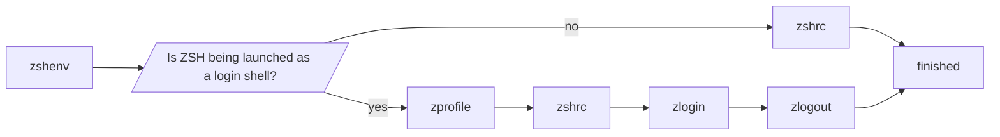

# Script Load Order

This markdown document will outline the order in which everything comes together.

`/etc/commonprofile` is sourced from `/etc/profile`, `/etc/bash.bashrc`, and
`/etc/zshenv`.

ZSH has 3 choices when starting up. I'll denote the different "stages" by their
filename. In each stage, first the `/etc(/zsh)/<filename>` script will be
executed. After that, the `$ZDOTDIR/.<filename>` script will be executed.

For non-interactive sessions (i.e. executing a ZSH script), only the `zshenv`
stage (`/etc(/zsh)/zshenv` followed by `$ZDOTDIR/.zshenv`) gets executed.

As for interactive sessions, here's a flowchart.

## Interactive Session

(note: `/etc/commonprofile` is a symlink to `common/commonprofile.sh`)

(note 2: for the `zlogout` stage, the order of the scripts is reversed for some reason)

(note 3: Bash load order is convoluted. So I'm just gonna link to
[this page](http://www.solipsys.co.uk/new/BashInitialisationFiles.html)
which already has a graph)
