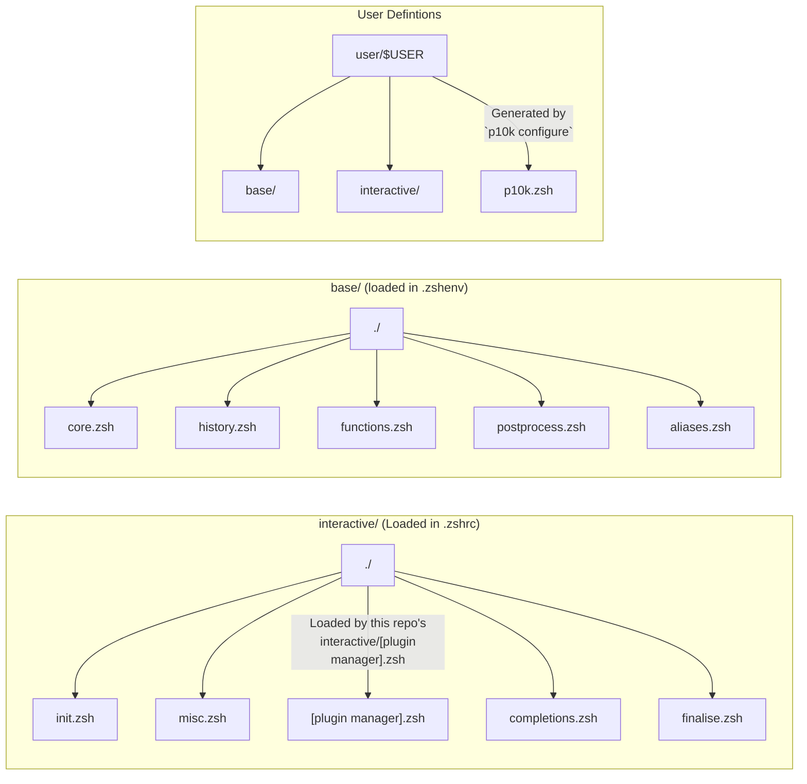

# User Definitions

The `user_defs` folder is gitignored, so don't worry about accidently committing anything defined in there.

NOTE: If you use Antidote as your plugin manager, your `antidote.zsh` file needs to echo out
your plugins (instead of using a txt file to specify your plugins).

This is an intentional decision, as it enables you to load things conditionally, while still
keeping the performance benefit of prebundling (the plugin bundle only gets rebuilt when you
make changes to your `antidote.zsh` file)

## Folder Structure

