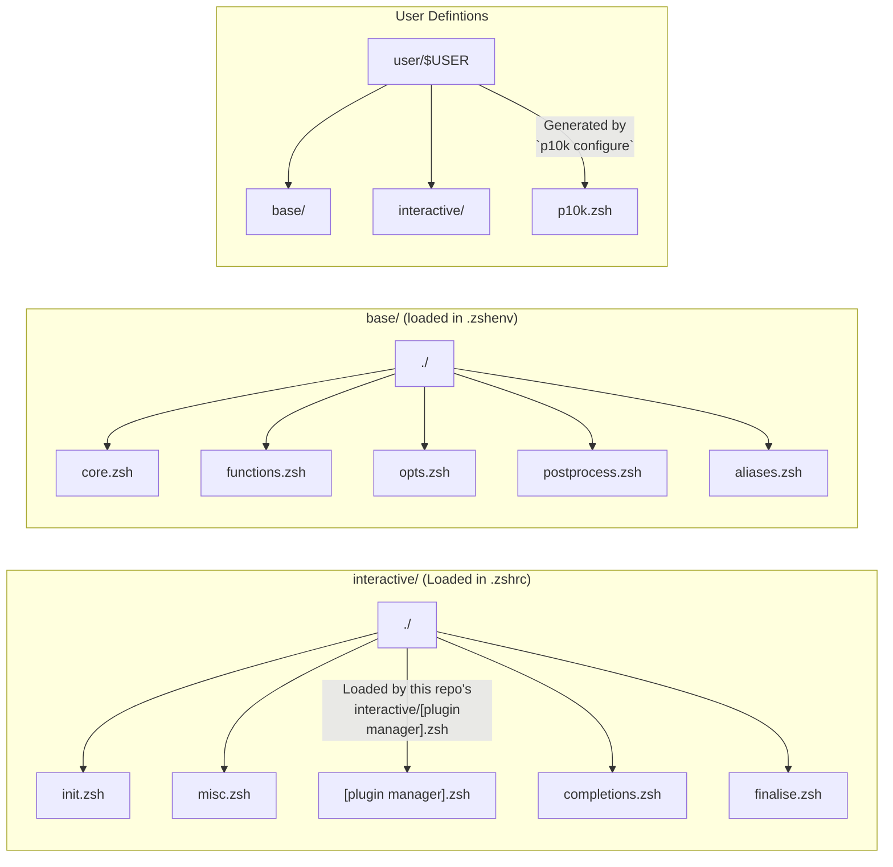

# User Definitions

The `user_defs` folder is gitignored, so don't worry about accidently committing anything defined in there.

## Folder Structure

```mermaid
flowchart LR
    subgraph interactive["interactive/ (Loaded in .zshrc)"]
        30["./"]
        31["init.zsh"]
        32["misc.zsh"]
        33["[plugin manager].zsh"]
        34["completions.zsh"]
        35["finalise.zsh"]

        30 --> 31
        30 --> 32
        30 --"Loaded by this repo's<br/> interactive/[plugin manager].zsh"--> 33
        30 --> 34
        30 --> 35
    end

    subgraph base["base/ (loaded in .zshenv)"]
        20["./"]
        21["core.zsh"]
        22["functions.zsh"]
        23["opts.zsh"]
        24["postprocess.zsh"]
        25["aliases.zsh"]

        20 --> 21
        20 --> 22
        20 --> 23
        20 --> 24
        20 --> 25
    end

    subgraph root["User Defintions"]
        00["user/$USER"]
        01["base/"]
        02["interactive/"]
        03["p10k.zsh"]

        00 --> 01
        00 --> 02
        00 -- "Generated by<br/> `p10k configure`" --> 03
    end

```
